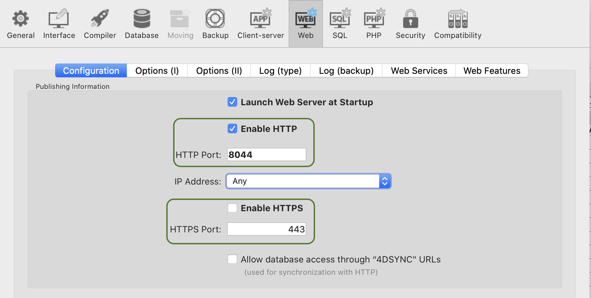

To render webforms, you must have an available license, as rendering a webform opens a session on the project database's main web server.

4D Web Studio's URL scheme configuration (HTTP and HTTPS) determines how many licenses are retained when rendering webforms. With the right configuration, you can avoid unnecessary license retaining.

For deployment, The 4D Web Admin server is not necessary. 

End-user access to your Web application made with 4D Web Studio is based on the 4D REST protocol. As such, it works as through a conventional 4D Client.

## URL Schemes

As explained in the [configuration](./4d-settings.md) section, the 4D [WebAdmin web server](https://developer.4d.com/docs/en/Admin/webAdmin.html) provides a secured web access to 4D Web Studio.

On the other hand, the [renderer](../rendering.md) communicates with the 4D web server of the database using REST requests. As such, it behaves like a conventional 4D Client.

If you run the renderer from the studio and these two web servers are not reached through the same URL scheme (HTTP or HTTPS), it might lead to wrong licence counting.

## Example

1. You run the Web Studio on an HTTPS URL scheme (e.g. `https://127.0.0.1:7443/studio/`)

2. The web server of your database is started only on an HTTP port.

3. In the studio, you click on the **rendering icon**. You are warned that the two web servers are started on different schemes, but despite this you click on the **Confirm** button. 

As a result, two licenses are retained.

## SameSite attribute

The behavior previously described is due to the session cookie of the 4D web server. This session cookie has a `SameSite` attribute that determines if the session cookie is sent to the web server.

If the `SameSite` attribute's value is `Strict` (default), the session cookie is not sent to the web server, so a new session is opened each time a page is rendered or refreshed.

For more information on the `SameSite` attribute, check out [this blog post](https://blog.4d.com/get-ready-for-the-new-`SameSite`-and-secure-attributes-for-cookies/).

## Recommendations

To avoid using more licenses than necessary, we recommend doing one of the following:

- Run the renderer on another browser tab (by entering the rendered URL of your Web form: `IP:port/$lib/renderer/?w=WebFormName`).

- Ensure the Web Studio and your database are reached on the same URL scheme.

- Use the `Lax` value for the [session cookie](https://developer.4d.com/docs/en/WebServer/webServerConfig.html#session-cookie-`SameSite`) of your project database's web server. 

