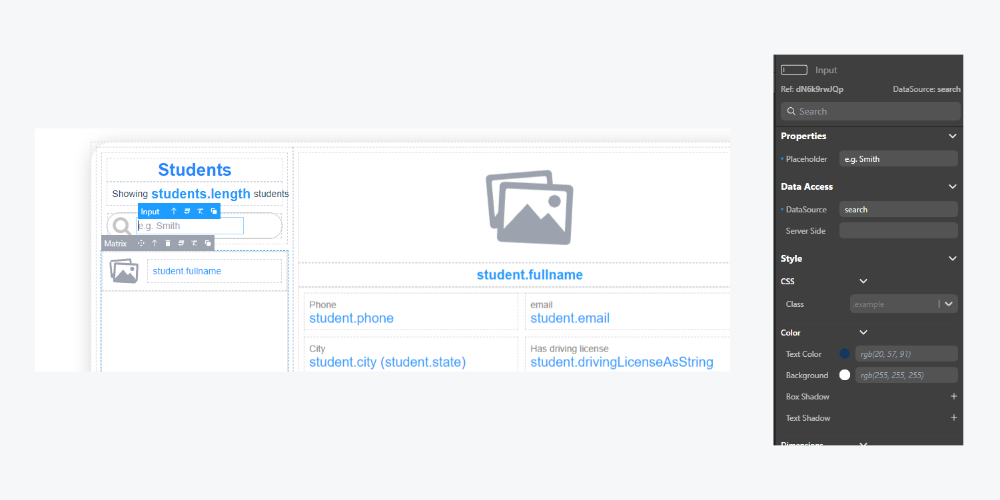

You can set events to trigger when your end-users perform certain actions, such as clicking a button.

#### Example: Creating a search feature using the `onChange` event

The objective is to update a list of students displayed in a **Matrix** component according to what the end-user types in an input area.

In the image below: 
* The **Input** element is bound to the local datasource `search` (of type Text)
* The **Matrix** component displays a list of students based on the `students` datasource, which is an entity selection



To display results corresponding to the text typed in the **Input** component, we need a `search` function that performs a query:

```4d
exposed Function search($search : Text)->$result : cs.StudentsSelection
	
$search:="@"+$search+"@"
	
$result:=This.query("firstname = :1 or lastname = :1"; $search)   
```

An **onChange** event calls the `search` function and passes the text typed in the **Input** element as a parameter. This updates the `students` datasource:


Now everytime the text changes inside the **Input** element, a query is sent and the list of students displayed in the **Matrix** component is updated.