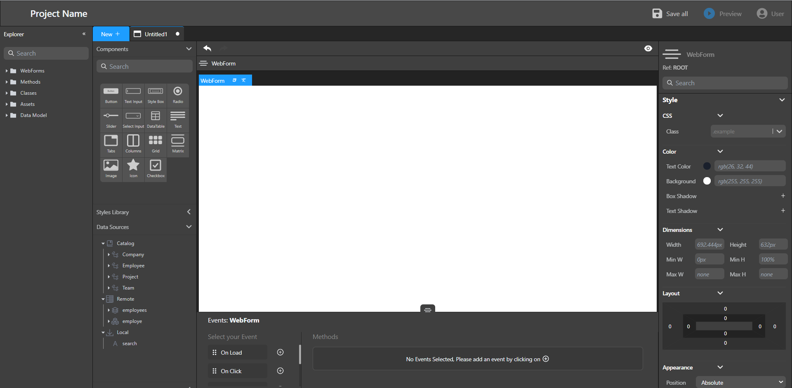

## Welcome to 4D Web Studio preview version

:::info

 4D Web studio is still a **code name** and may not be the final product's name.

:::

After several months of research and development, we've decided to release a very first preview version of 4D Web Studio.

## What is 4D Web Studio?

4D Web Studio is a powerful platform for web design and development powered by 4D and ORDA. It introduces a new way of building complete web applications. 

The goal is to provide developers with an experience that takes place exclusively in the web browser. This includes: 
* designing webforms by dragging and dropping components on a canvas
* previewing pages directly in the browser
* mapping data easily thanks to ORDA data classes
* directly executing 4D code on a web event or a datasource event 
* coding & debugging in the browser
* editing a data model

At the end of the road, 4D developers will be able to build complete web business applications using only their web browsers and 4D coding skills. There is no Javascript involved.

## What to expect from this preview version

By joining this preview, you will discover a totally new web UI. You will get familiar with the concept of datasources and learn how to create webforms by placing components on a page, how to map components to data, how to trigger 4D code (dataclass functions or project methods) by configuring events.

Since this is a preview version, you'll be using an unfinished product, and you can expect bugs to happen. If you'd rather have a bug-free experience, we recommend waiting a few more months.

As usual in such situations, we do not recommend using this product in a production environment yet.

## Who should use 4D Web Studio

In order to get the best experience, 4D Web Studio currently requires a precise set of 4D skills:
	• Knowledge of project mode: 4D Web Studio won’t run in binary mode
	• Knowledge of ORDA: 4D Web Studio relies heavily on dataclasses
	• Being familiar with the 4D REST server and API

Having used a recent version of 4D, such as 4D v18 or v19, is also recommended

If you are not familiar with the concepts listed above, we suggest following one of our dedicated training sessions.

## A few things to know before you start using 4D Web Studio

## Use cases

With 4D Web Studio, you can either build a new web application from scratch, but you can also open an already existing 4D project and start adding webforms to your existing application.

:::info Important

4D web studio doest not allow "converting" a 4D desktop form into a 4D webform.

:::

## 4D and 4D Server

You can use 4D Web Studio with both 4D and 4D Server. This allows you to work on your own, or within a team with a version control system (VCS) such as Git, and see the results in a shared 4D Server.

## WebAdmin web server versus 4D web server

4D Web Studio runs through the [4D WebAdmin web server](https://developer.4d.com/docs/en/Admin/webAdmin.html). 4D will prompt you to activate it if necessary. When you use 4D Web Studio as a developer, even when you preview a webform in the studio, you’re using the 4D Web Admin server. This allows you to see dataclasses, functions and attributes that are not exposed as Rest resources for example.

However, webform rendering outside 4D Web Studio is served by the [standard 4D web server](https://developer.4d.com/docs/en/WebServer/webServer.html). In this situation, your web application cannot access assets that are not exposed as REST resources.

## About webforms
4D Web Studio does not generate HTML code directly. When you drop components on the canvas, when you map datasources to components, or when you configure an event, 4D Web Studio places your work in a json file. This json file, the webform, cannot directly be opened in a web browser. It is “rendered” either when you preview it in the webstudio, or when you choose to render it in a dedicated browser tab.

## About REST 
All 4D code executed from a webform is in fact triggered through the 4D REST API. This makes it possible for you to use your browser’s developer’s tools to inspect your rendered webform and troubleshoot REST requests and responses.

## Debugging 4D Code
Until the online debugger is available, if you use 4D Web Studio on your local workstation together with 4D, placing a breakpoint in your code makes it possible for you to debug 4D code triggered from a 4D webform.

## Known limitations

Since the web studio is still in early stages of development, some features are not yet available. At this stage:

* The debugger is not available yet

* Navigation features are still in development, but you can already embed a Webform inside another using the [Webform Loader](../webforms/using-web-form-editor.md#component-list)
