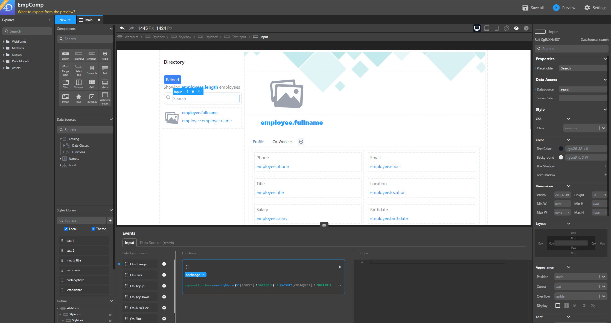

## Welcome to 4D Web Studio preview version

:::note info

 At this stage, 4D Web Studio is a codename for the product. It may not be its final name.

:::

## What is 4D Web Studio?

4D Web Studio is a new way of building business web applications, powered by 4D. Our vision is to provide developers a 100% web browser experience by allowing them to:

* design web forms visually by drag and dropping components on a canvas
* preview pages instantly
* easily map data with ORDA data classes
* directly execute 4D code on web events or datasource events
* code & debug in the browser
* and even edit a data model

At the end of the road, developers will be able to build complete web business applications using only a web browser and their 4D coding skills. There is no Javascript involved.

## Hello World

This 5-minute video provides a "Hello World" example and covers how to enable access to the studio, create a basic interface, and configure an event that greets the user by their name:

<iframe width="560" height="315" src="https://www.youtube.com/embed/GwIdic4OhPQ" title="YouTube video player" frameborder="0" allow="accelerometer; clipboard-write; encrypted-media; gyroscope; picture-in-picture" allowfullscreen></iframe>

## What to expect from this preview version

In 4D Web Studio, you will discover a totally new web UI, get familiar with the concept of datasources, and learn how to:
* create webforms by placing components on a page
* map components to data
* trigger 4D code (dataclass functions or project methods) by configuring events

Since this is a preview version, you'll be using an unfinished product, and you can expect bugs to happen. If you'd rather have a bug-free experience, we recommend waiting a few more months.

As usual in such situations, we do not recommend using this product in a production environment yet.

## Technologies used

In order to get the best experience possible, 4D Web Studio currently requires a precise set of 4D skills:
* knowledge of project mode: 4D Web Studio won’t run in binary mode
* knowledge of [ORDA](https://developer.4d.com/docs/en/ORDA/overview.html): 4D Web Studio relies heavily on [dataclasses](https://developer.4d.com/docs/en/ORDA/dsmapping.html#dataclass)
* being familiar with the [4D REST server](https://developer.4d.com/docs/en/REST/gettingStarted.html) and API

## Before you start

Here are a few things to know before you start using 4D Web Studio.

### Use cases

With 4D Web Studio, you can either build a new web application from scratch, or open an already existing 4D project and start adding webforms to your existing application.

:::note Info

4D Web Studio does not allow "converting" a 4D desktop form into a 4D webform.

:::

### 4D and 4D Server

You can use 4D Web Studio with both 4D and 4D Server. This allows you to work on your own, or within a team with a version control system (VCS) such as Git, and see the results in a shared 4D Server.
### About REST 
All 4D code executed from a webform is in fact triggered through the 4D REST API. This makes it possible for you to use your browser’s developer tools to inspect your rendered webform and troubleshoot REST requests and responses.

### Debugging 4D Code
Until the online debugger is available, if you use 4D Web Studio on your local workstation together with 4D, placing a breakpoint in your code makes it possible for you to debug 4D code triggered from a 4D webform.

### Known limitations

Since 4D Web Studio is still in early stages of development, some features are not yet available.

 At this stage:
* The debugger is not available yet
* Navigation features are still in development, but you can already embed a webform inside another using the [Webform Loader](design-webforms/create-webform.md#component-list) and attach [navigation actions to events](design-webforms/events/events.md#bind-a-navigation-action-to-an-event).
