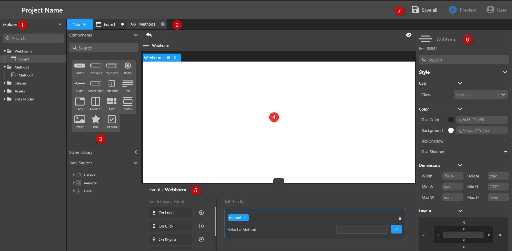
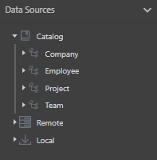
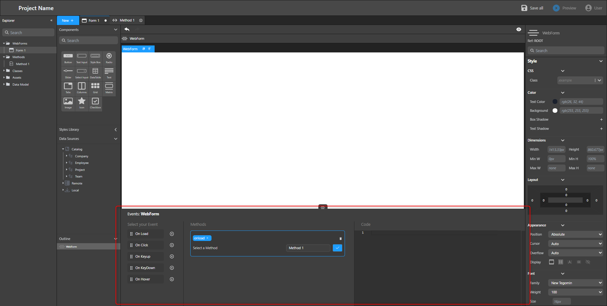

## Creating a WebForm

In 4D WebStudio, everything starts with a WebForm. A WebForm is a container that holds all the other components (buttons, grids, style boxes, etc.) of your application.

To create a WebForm:
* from the homepage, click **Webform** and enter a name for the new Webform. The WebForm editor opens.
* from the WebForm editor, click the **New +** tab > **Webform**

## Web Form Editor Interface

The Web Form Editor provides several tools to customize the interface and contents of your application:

<ol class="interface-numbers">
<li class="interface-item">Explorer: Displays your project's web forms, methods and classes (assets and data models are not available yet)</li>
<li class="interface-item">Tabs: They let you keep track of your currently opened elements, such as your forms and methods.</li>
<li class="interface-item">Components: The building blocks of your end user's application interface. </li>
<li class="interface-item">Canvas: This is where you combine your components, styles and data sources. You can drag and drop components onto your canvas, then drag and drop CSS classes and data sources onto these components.</li>
<li class="interface-item">Contextual configuration panel: This is where you link events and methods to your components, edit CSS styles, etc.</li>
<li class="interface-item">Properties panel: Allows for advanced style customization. Also allows binding a datasource to a component.</li>
<li class="interface-item">Menu buttons: Save all your work, preview the end user's application</li>
</ol>

## Adding components to the Web Form

Components are the building blocks of your application. To add a component, drag it from the Components section and drop it on the canvas.

## Keeping track of the structure

You can use the following tools to manage your components and keep track of them.

### Breadcrumbs

When you select a component, the breadcrumbs display its hierarchy:

To select any parent component displayed in the breadcrumbs trail, click its name. 

### Tooltip

When you select a component, the tooltip displays its type and offers several actions:

|Icon|Description|
|---|---|
|Cursor|Move the selected component on the canvas|
|Arrow|Select the parent component|
|Delete|Remove the selected component from the canvas|
|CSS|Export the selected element's style to a CSS class|
|Barred T|Reset styles|
|Duplicate icon|Duplicate the component|

The tooltip is contextual. This means that some actions are only available to certain elements, and not others. For example, you can duplicate a Text Input component, but not its individual parts (Label and Input).

### Outline

The outline section displays the hierarchy of your Webform. You can click an element in the list to select it, or click and drag it anywhere in the outline to move it somewhere else.

To display or hide an element, click the eye icon.

## Styling a component 

Inside a WebForm, you can style components using the Properties panel and the Styles library and see the result directly on the canvas.

### Resources and Tools

If you're not familiar with CSS properties and styles, or you need a refresher, here are a few useful links:

* Learn CSS on the [MDN website](https://developer.mozilla.org/en-US/docs/Learn/CSS/Building_blocks/Cascade_and_inheritance)
* A guide to [flexbox properties](https://css-tricks.com/snippets/css/a-guide-to-flexbox/) on css-tricks.com
* [Box-shadow examples](https://getcssscan.com/css-box-shadow-examples)
* [Box-shadow generator](https://cssgenerator.org/box-shadow-css-generator.html)

### Styles Library 

One way of styling components is by dragging CSS classes from the Styles library and dropping them on the components.

The Styles Library offers two types of styles: 
* Local: Styles you create
* Theme: Predefined CSS classes

Unlike Theme classes, Local styles can only be used in the Web Forms in which they are created. 

### Properties Panel

The properties panel gives you extremely granular control over your elements. 

After you select an element, you can edit its properties using this panel. This includes style properties (as a rule, component properties and styling are separated).

Using the properties panel, you can bind a CSS class to the element and define values individually.

Some visual properties, such as grid areas or column size in datatables, can be edited directly on the canvas.

#### Example 

To add a red background to a Button component: 
* From the Styles library:
drag the `bg-red-500` class from the Styles library and drop it on the Button component

* Using the Properties Panel:
    * Select the Button component, and under Style, choose a red color for the background
    * Select the Button component, and in the properties panel, select the `bg-red-500` class in the CSS section

### Overridden properties

When you edit CSS using the properties panel, it overrides the CSS defined for the component (default styles and CSS classes applied). Overriden properties have a blue dot in front of them. 

## Exporting styles as CSS classes for reuse 

You can export the style of an element as a CSS class to reuse it later: 
1. Select a an element on the canvas, the tooltip appears
2. Click the CSS icon in the tooltip and enter a name for the new CSS class
3. Click **Export**

This exports the style of the element as a local CSS class. Now it appears as a choice in the Styles library and in the property list, and you can apply the class to other elements on your canvas. 

Note that only the [overridden properties](#overriden-properties) are exported as a CSS class.

### Editing a CSS class

Once a local class is created, you can hover over it in the Styles Library and click the **Edit Class** button next to its name to edit the CSS directly. The changes apply to all the components using this class.

## Component List

The Component area lets you search for a component or choose one from the list. Once a component is on the canvas, you can [customize its look](#styling-a-component) and (for some components) assign a data source to it.

The following components are available: 

|Component|Description|
|---|---|
|Web Form| Base container that holds all the other components| 
|Style box| Container used to keep the content centered and legible |
|Grid| Allows you to produce complex and responsive layouts faster. Grid areas can be edited directly on the canvas |
|Columns|Displays data inside columns|
|Tabs|Organizes and allows navigation between groups of content that are related and at the same level of hierarchy|
|Text input|Allows users to enter data in a form|
|Button|Triggers actions on a web page. Serves as call to action (CTA) and links to pages, forms, assets, and more|
|Radio button|Allows selecting one of a set of options (only one option can be selected at any time)|
|Range input|Allows selecting a range of numeric values|
|Select box|Allows selecting an item in a list|
|Image|Displays an image|
|Icon|Displays an icon|
|Check box|Allows the user to make a binary choice (boolean value)|
|Text|Displays text on a web page|
|Datatable|Displays data in the form of a table. Rows can be selected to interact with the server|
|Matrix| Container of repeated style boxes|
|Web Form Loader| Allows you to embed a webform inside another

> More components will be available in the future, and existing components will be enhanced.

## About data sources

Data sources contain data. You can bind them to your webform components to determine where the data is displayed in your application.

The **Data Sources** section groups the available data sources:

In this section, you'll find the following:

*  The **Catalog** holds:
    * data from your database: You can designate entities or entity selections from your [datastore](../ORDA/dsMapping.md#datastore), and they will be handled by the server as **Remote** data sources.
    * Class functions: The Catalog displays the functions defined in each class. 

*  **Remote** data sources: Entities and entity selections, handled on the server, that can be assigned to components. 
They offer functions defined on the ORDA classes that they instantiate (Entity class, Entity Selection class).

> When working with 4D projects, only the dataclasses and dataclass attributes [exposed as REST resources](https://doc.4d.com/4Dv19/4D/19/Field-properties.300-5416814.en.html) will be available at run time. 

*  **Local** data sources: Scalar types handled with the browser's memory. Can be assigned to variables. No request is sent to the server to access local data sources.

Only [exposed functions](../ORDA/ordaClasses.md#exposed-vs-non-exposed-functions) can be used when configuring an event. Functions and attributes that are not exposed are greyed out.

## Creating a data source

To create a data source: 

## Binding a data source to a component: 

There are several ways to bind a data source to a component:

* Drag it from the Data Source section and drop it on a component
* Enter the name of the data source in the Properties panel > Data source

## Events, methods and class functions

## Events

Events are usually used as a means of triggering certain behaviors. They are used in conjuction with methods and class functions. 

For example, if the user clicks a button on a webpage, you can choose how to react. 

In 4D WebStudio, events are used to execute code on the 4D server. There's no need to write additional Javascript or React code.

Events are executed in the defined order, and you can map one method to several events or one event to several methods.

## Methods

Methods allow you to determine how to react to certain events.

For example, to make a search bar, you can attach an `onchange` event to a Text input component and write a method that taps into a [dataclass](../ORDA/dsMapping.md) to suggest a list of items as the user is typing. 

## Class Functions

Just like methods, some 4D class functions allow you to set the behavior of your components.

For example, to display or hide a component when an event occurs, you can use the [4D.WebFormItem class functions](../API/web-form-editor/WebFormItemClass.md)

## Server-side reference

The server-side reference of a component is its "address" on the server. To set the behavior of a component, you can assign a server-side reference to it, and then [use that reference in class functions](../API/web-form-editor/WebFormItemClass.md).

For example, `WebForm.myImage` refers to the image component with `myImage` as server-side reference.

To assign a server-side reference to a component, enter a value in the Properties Panel > Server Side:

You can then modify the behavior of your components using events and functions, such as [4D.WebFormItem class functions](../API/WebFormItemClass.md).